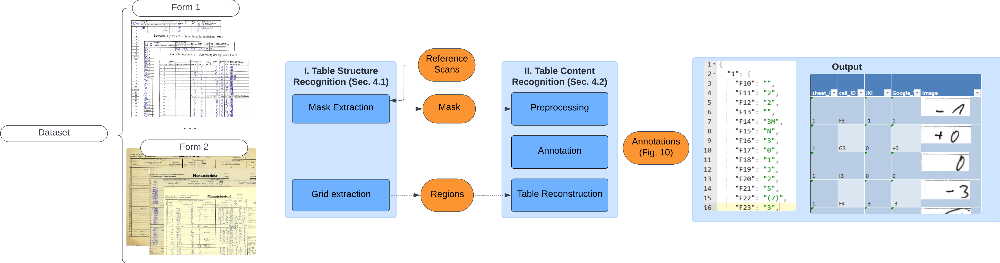
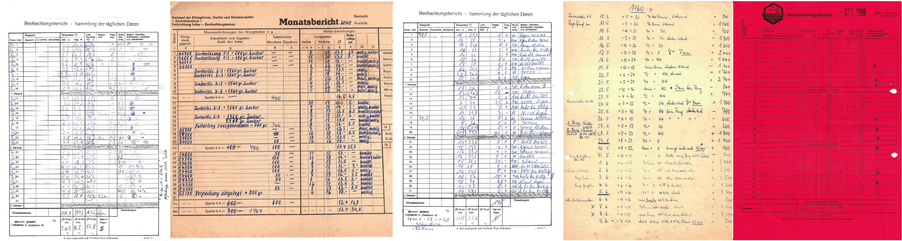

# BeeProject

This work semi automate transcribing historical handwritten tables. Our presented method works on a mixture 
of computer vision tools and optical character recognition (OCR) to detect the grid and content of the table. 



## Quick start

Let's start a test run on the BeeProject dataset. 

Clone repository and navigate to the project: 
```shell
git clone https://github.com/mertova/BeeProject.git
cd BeeProject
```

```shell

```

-----------------------------------
## The BeeProject Collection



The dataset we collected contains records from beekeepers, consisting of hive weight gain and loss 
and meteorological conditions. The institute of bee protection from JKI  gathered this information from 
the German beekeeper associations of Lower Saxony, Hesse, Mecklenburg-Vorpommern, Thuringia, and Brandenburg 
in Germany within the collaborative research project MonViA. The sample of the dataset is available [here][1] and full 
dataset can be accessed via [this link][2]. Please cite our dataset wit this citation: [[1]](#1).

[1]: https://github.com/mertova/TheBeeProjectCollection.git        "GitHub: The BeeProject Collection - sample"
[2]: https://fairdomhub.org/data_files/7415?version=1              "Fairdomhub: The BeeProject Collection - full"

-----------------------------------
## Digitize your data
Supported formats. 

Our source code is organized as follows: 
```
.
├── resources
│   ├── credentials                 # place to store your credentials 
│   ├── data                        # place to store your data to be digitized
│   └── play-data                   # a sample from our BeeProject collection     
├── src
│   ├── 
│   ├──
│   ├──
│   └── 
├── test                            # test files
├── execute_digitalization.py       # 
└── execute_extraction.py           #
```
1. place your data in 

As shown in the picture above, the digitisation process consists of 2 steps: 
### 1. Table extraction
```shell
python execute_extraction.py 
  - dataset
  - output
  - reference image
  - 
```


| Flag | Full name   | Type | Default                      | Description                                                          |
|------|-------------|------|------------------------------|----------------------------------------------------------------------|
| -d   | --dataset   | str  | -                            | Path to the dataset                                                  |
| -r   | --reference | str  | -                            | Path to the representative image                                     |
| -ev  | --epsilon_v | int  | 10                           | Epsilon - deviation for a vertical grid lines                        |
| -eh  | --epsilon_h | int  | 15                           | Epsilon - deviation for a horizontal grid lines                      |
| -l   | --limit     | int  | 15                           | Limit the sample files for table extraction                          |
| -t   | --transform | bool | True                         | Transformation (alignment) of sample resources to the reference file |
| -o   | --output    | str  | ./resources/data/extraction/ | Path to the output folder                                            |


 #### Output 
1. Form image: 

2. Json output example: 
```json
{
  "cells": [{
      "id": "A0",
      "id_col": "0",
      "id_row": "0",
      "pt1": [0, 0],
      "pt2": [71, 287]},
    { "id": "B0",
      "id_col": "1",
      "id_row": "0",
      "pt1": [71, 0],
      "pt2": [211, 287]}, 
    ...]
}
```
### 2. Digitization
```shell
python execute_extraction.py 
  - dataset
  - output
  - reference image
  - 
```


| Flag | Full name | Type | Default | Description                                 |
|------|-----------|------|---------|---------------------------------------------|
| -d   | dataset   | str  | -       | path to the dataset                         |
| -o   | output    | str  | -       | path to the out folder                      |
| -ref | reference | str  | -       | path to the representative image            |
| -ev  | epsilon_v | int  | 10      | Raster for vertical lines                   |
| -eh  | epsilon_h | int  | 15      | Raster for horizontal lines                 |
| -l   | limit     | int  | 15      | limit the sample files for grid extraction  |
| -t   | transform | bool | True    | Transformation (alignment) of sample images |

#### Output
1. Form image: 

2. Json output example: 
```json
{
  "cells": [{
      "id": "A0",
      "id_col": "0",
      "id_row": "0",
      "pt1": [0, 0],
      "pt2": [71, 287]},
    { "id": "B0",
      "id_col": "1",
      "id_row": "0",
      "pt1": [71, 0],
      "pt2": [211, 287]}, 
    ...]
}
```
--------------------------------------------
## Getting credentials from OCR Services

In order to get better results, use following OCR APIs: Amazon AWS Textract, Google Vision, Microsoft Azure. 
For each one of them you need to register and generate access keys.


### - AWS Textract:
AWS - Amazon Web Services 
**textract** for text analysis. For more information, visit: https://docs.aws.amazon.com/textract/latest/dg/what-is.html

For Boto3 python installation, visit: https://boto3.amazonaws.com/v1/documentation/api/latest/guide/quickstart.html

How to get credentials:
https://docs.aws.amazon.com/textract/latest/dg/getting-started.html
1. Get you account to the Amazon AWS Console via this link: https://aws.amazon.com
2. Set up your Identity and Access Management (IAM)
3. Find you key and endpoint (Note)


#### Example of the credentials file
```yaml
{
    "microsoft_api_key": {
        "SUBSCRIPTION_KEY": "your key goes here",
        "ENDPOINT": "https://your_project.cognitiveservices.azure.com/"
    }
}
```

### - Google vision 
1. create an account on Google Cloud: https://cloud.google.com/
2. create a project
3. and go to IAM & Admin and create a role: https://cloud.google.com/iam/docs/grant-role-console
4. generate a json credentials file

Document Text detection documentation: https://cloud.google.com/vision/docs/handwriting
All documentation is here: https://cloud.google.com/docs

#### Example of the credentials file
```yaml
{
    "type": "service_account",
    "project_id": "your_project",
    "private_key_id": "your key ID",
    "private_key": "your key",
    "client_email": "google-vision@your_project.iam.gserviceaccount.com",
    "client_id": "client_id",
    "auth_uri": "https://accounts.google.com/o/oauth2/auth",
    "token_uri": "https://oauth2.googleapis.com/token",
    "auth_provider_x509_cert_url": "https://www.googleapis.com/oauth2/v1/certs",
    "client_x509_cert_url": "",
    "universe_domain": "googleapis.com"
}
```
### - Microsoft Azure
Guide:
https://programminghistorian.org/en/lessons/transcribing-handwritten-text-with-python-and-azure

#### Example of the credentials file

Find your key and endpoint (Note: Check that your location is set correctly.)
```yaml
{
    "microsoft_api_key": {
        "SUBSCRIPTION_KEY": "your key goes here",
        "ENDPOINT": "https://your_project.cognitiveservices.azure.com/"
    }
}
```

--------------------------------------------

### References
<a id="1">[1]</a> 
Mertová, L., Lewkowski, O., Polreich, S., & Müller, W. (2024). 
BeeProject-collection [Data set].
FAIRDOMHub. https://doi.org/10.15490/FAIRDOMHUB.1.DATAFILE.7415.1

